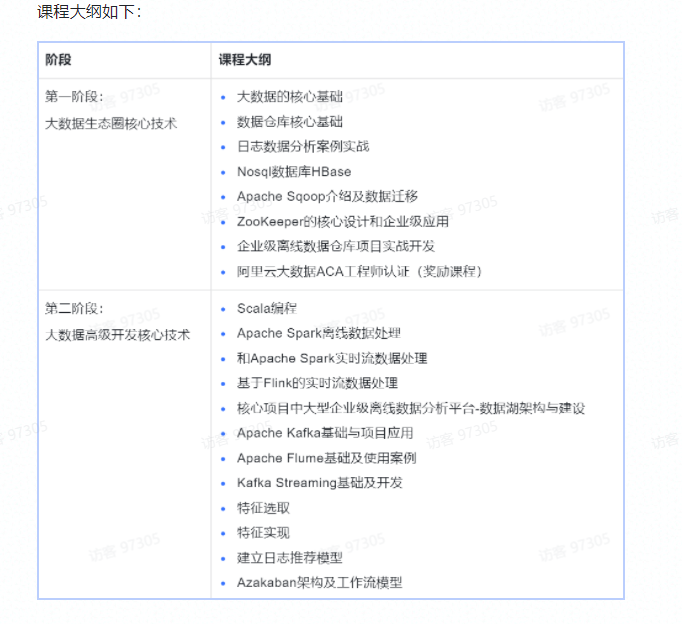

# 深度之眼.大数据开发实战

### 目录

- [第1节.大数据概况及Hadoop生态系统](Bigdata_development/chapter01.md)
- [第2节.Hadoop分布式文件系统HDFS](Bigdata_development/chapter02.md)
- [第3节.MapReduce 编程模型基础和实践](Bigdata_development/chapter03.md) （2022.3.16）
- [第4节.Hive-数据仓库基础](Bigdata_development/chapter04.md) （2022.3.19）
- [第5节.Hive-数据仓库进阶](Bigdata_development/chapter05.md) （2022.3.23）
- [第6节.Hive-数据仓库实战](Bigdata_development/chapter06.md) （2022.3.26）
- [第7节.项目实战-日志数据分析](Bigdata_development/chapter07.md) （2022.3.30）
- [第8节.项目实战-用户消费数据分析](Bigdata_development/chapter08.md) （2022.4.2）
- [第9节.Nosql综述和ApacheHBase基础](Bigdata_development/chapter09.md) （2022.4.6）
- [第10节.Apache HBase进阶及性能优化](Bigdata_development/chapter10.md) （2022.4.9）
- [第11节.Apache Sqoop介绍及数据迁移](Bigdata_development/chapter11.md) （2022.4.13）
- [第12节.ZookKeeper的核心设计和企业级应用](Bigdata_development/chapter12.md) （2022.4.16）
- [第13节.企业级离线数据仓库项目实战开发](Bigdata_development/chapter13.md) （2022.4.20）

### 课程内容简介

介绍地址：

[https://deepshare.feishu.cn/docs/doccnD7CSY787vusiBV8D1zsvAh](https://deepshare.feishu.cn/docs/doccnD7CSY787vusiBV8D1zsvAh)

部分截图：



```
> **大数据的基础必备**
>
> - JavaSE编程
> - 数据库Mysql数据库的应用，掌握基于SQL常用操作
> - 掌握Linux常用命令
> - 基于XML的解析
> - 基于maven构建project
> - 书籍推荐：《Hadoop权威指南》《HBase权威指南》
```

## 参考资料

1. [mermaid官方文档](https://mermaid-js.github.io/mermaid/#/flowchart?id=special-characters-that-break-syntax)
2. [文档中心-Ambari使用指南 - 金山云](https://docs.ksyun.com/documents/5519)
3. [Ambari 架构](https://ifeve.com/ambari-1/)
4. [百度.IT小尚](https://author.baidu.com/home?from=bjh_article&app_id=1703817847568260)
