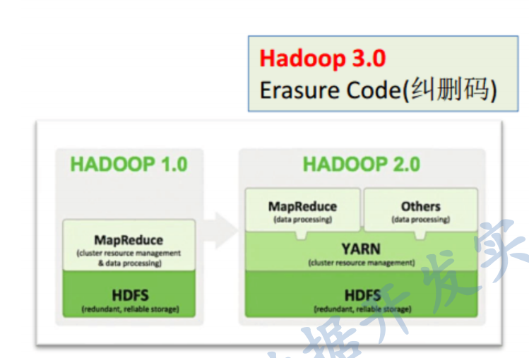
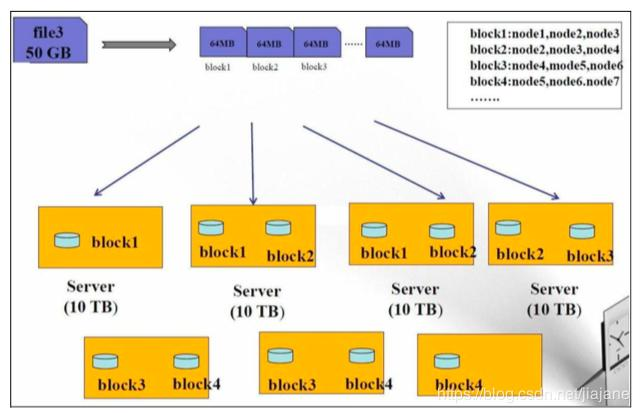

# 第1节.大数据概况及Hadoop生态系统 :id=1

## 1.1 知识点 :id=1.1

- 了解大数据概论及属性
- 了解大数据分布式处理的基本方法
- 了解Hadoop生态系统
- 理解Hadoop框架及核心模块
- 掌握HDFS基本文件操作命令
- 掌握用Java实现HDFS文件读写

## 1.2 大数据概论及属性 :id=1.2

### 大数据定义

**大数据(Big Data)** 指无法在可承受的时间范围内用常规软件工具进行捕捉、管理和处理的数据集合，
是需要新处理模式才能具有更强的决策力、洞察发现力和流程优化能力的海量、高增长率和多样化的信息资产。

### 大数据四大特征

- 数据量大（Volume） - 过去两年产生了90%的数据量，未来有50%的数据将通过Hadoop这个平台产生
- 处理速度快（Velocity） - 为了实现快速分析海量数据的目的，新兴的大数据分析技术通常采用集群处理和独特的内部设计。
- 数据类型繁多（Variety） - 大数据的数据来源众多，生物大数据、交通大数据、医疗大数据、电信大数据、电力大数据、金融大数据等
- 价值密度低（Value）- 价值密度却远远低于传统关系数据库中已经有的数据。

### 数据分析

**数据分析**是基于**商业目的**，有目的的进行收集、整理、加工和分析数据，**提炼有价值信息**的过程。

1. 需求分析明确目标
2. 数据收集加工处理
3. 数据分析数据展现
4. 分析报告提炼价值

### 数据的特点

- 基于时间 - 数据产生的时间是一个重要的元素
- 不可变更性 - 数据的真实性不会改变。 我们将大数据的变化视为新条目，而不是现有条目的更新

### 传统分布式和基于Hadoop的分布式

- **传统的分布式计算的特点:数据向计算靠拢**

  - 计算受CPU限制
  - 数据量相对较小
  - 对数据进行大量的复杂处理
  - 主要的推动力是增加单台机器的计算力
  - 通常在计算时，数据被复制到计算节点
- **基于Hadoop的新型分布式计算:计算向数据靠拢**
- 分布式存储数据，**数据不用复制到计算节点**
  - 将程序分发到数据节点，处理大数据成为可能
  - 廉价的机器群就可以实现
  - 算法支持并行运算

## 1.3 Hadoop简介  :id=1.3

Hadoop 是一个可靠的，可伸缩的，开源的分布式计算软件。

Apache Hadoop软件库是一个框架，该框架允许使用简单的编程模型跨计算机集群对大型数据集进行分布式处理。它被设计成从单个服务器扩展到数千台机器，每台机器都提供本地计算和存储。本身的设计目的是在应用层检测和处理故障，而不是依赖硬件来提供高可用性，因此在计算机集群之上提供高可用性服务，而每个节点都容易发生故障

### Hadoop vs RDMS


|                          | Relational                                                                     | Hadoop                                                                                                               |
| -------------------------- | -------------------------------------------------------------------------------- | ---------------------------------------------------------------------------------------------------------------------- |
| Schema(模式)             | Require Write                                                                  | Required Read                                                                                                        |
| Speed(速度)              | Reads are fast                                                                 | Writes are fast                                                                                                      |
| Govemance(管理)          | Stanards and structured(标准和结构化)                                          | Loosely structured(结构松散)                                                                                         |
| Processing               | Limited,no data processing (局限，无数据处理)                                  | processing coupled with data(处理数据)                                                                               |
| Data Types               | Structured(结构化)                                                             | structured,semi-structured,Un structured                                                                             |
| Best Fit Use(最适合使用) | Complex ACID Transactions,Operational Data Store(复杂ACID事务，操作，数据存储) | Data Discovery,Processing un structured data,Massive storage/processing(数据探索，处理非结构化数据，大规模存储/处理) |

> * (Hadoop并不是要取代关系数据库。 Hadoop用于存储大数据，这通常是由于大小或成本限制而无法存储
>   在RDB中的数据类型)

### OLAP和OLTP的区别

```md
联机分析处理(OLAP)的概念最早是由关系数据库之父E.F.Codd于1993年提出的，他同时提出了关于OLAP的12条准则。OLAP的提出引起了很大的反响，OLAP作为一类产品同联机事务处理（OLTP）明显区分开来。
当今的数据处理大致可以分为两大类：联机事务处理OLTP(on-line transaction processing)、联机分析处理OLAP(On-LineAnalytical Processing)。
OLTP是传统的关系型数据库的主要应用，主要是基本的、日常的事务处理、例如银行交易。
OLAP是数据仓库系统的主要应用，支持复杂的分析操作，侧重决策支持，并且提供直观易懂的查询结果。


```

下表列出了OLTP和OLAP之间的比较。


| 比较项目           | 联机业务                             | 批处理业务                               |
| -------------------- | -------------------------------------- | ------------------------------------------ |
| 操作特点           | 日常业务操作，尤其是包含大量前台操作 | 后台操作，例如统计报表、大批量数据加载。 |
| 响应速度           | 优先级最高，要求响应速度非常高       | 要求速度高，吞吐量大                     |
| 吞吐量             | 小                                   | 大                                       |
| 并发访问量         | 非常高                               | 不高                                     |
| 单笔事务的资源消耗 | 小                                   | 大                                       |
| SQL语句类型        | 抓哟是插入和修改操作（DML）          | 主要是大量查询操作或批量DML操作          |
| 索引类型           | B*索引                               | Bitmap,Bitmap join 索引                  |
| 索引量             | 适量                                 | 多                                       |
| 访问方式           | 按索引访问                           | 全表访问                                 |
| 连接方式           | Nested_loop                          | Hash join                                |
| BIND 变量          | 使用或强制使用                       | 不使用                                   |
| 并行技术           | 使用不多                             | 大量使用                                 |
| 分区技术           | 使用，但目标不同                     | 使用，但目标不同                         |
| 物化视图           | 少量使用                             | 大量使用                                 |

## 1.4 Hadoop架构  :id=1.4

Hadoop是Apache软件基金会旗下的一个开源分布式计算平台，为用户提供了系统底层细节透明的分布式基础架构。Hadoop是基于Java语言开发的，具有很好的跨平台特性，并且可以部署在廉价的计算机集群中。

Hadoop的核心是分布式文件系统HDFS（Hadoop Distributed File System）和MapReduce。

- HDFS是对谷歌文件系统(Google File System，GFS）的开源实现，是面向普通硬件环境的分布式文件系统，具有较高的读写速度、很好的容错性和可伸缩性，支持大规模数据的分布式存储，其冗余数据存储的方式，很好地保证了数据的安全性。
- MapReduce是针对谷歌MapReduce的开源实现，允许用户在不了解分布式系统底层细节的情况下开发并行应用程序，采用MapReduce来整合分布式文件系统上的数据，可保证分析和处理数据的高效性。借助于Hadoop，程序员可以轻松地编写分布式并行程序，可将其运行于廉价计算机集群上，完成海量数据的存储与计算。


Hadoop是一个能够对大量数据进行分布式处理的软件框架，并且是以一种可靠、高效、可伸缩的方式进行数据处理，它具有以下几个方面的特性：

- **高可靠性：** 采用冗余数据存储方式，即使一个副本发生故障，其他副本也可以保证正常对外提供服务。Hadoop按位存储和处理数据的能力，值得人们信赖。
- **高效性：** 作为并行分布式计算平台，Hadoop采用分布式存储和分布式处理两大核心技术，能够高效地处理PB级数据。Hadoop能够在节点之间动态地移动数据，并保证各个节点的动态平衡，因此处理速度非常快。
- **高可扩展性：** Hadoop的设计目标是可以高效稳定地运行在廉价的计算机集群上，可以扩展到数以千计的计算机节点。
- **高容错性：** 采用冗余数据存储方式，自动保存数据的多个副本，并且能够自动将失败的任务进行重新分配。
- **成本低：** Hadoop采用廉价的计算机集群，成本较低，普通用户也很容易用自己的PC上搭建Hadoop运行环境，与一体机、商用数据仓库以及QlinkView、Yonghong Z-Suit等数据集相比，Hadoop是开源的，项目的软件成本因此会大大降低。
- **运行在Linux平台上：** Hadoop是基于Java语言开发的，可以较好地运行在Linux平台上。
- **支持多种编程语言：** Hadoop上的应用程序也可以使用其他语言编写，如C++.

Hadoop 模块：

- **Common:** 支持其他模块的公用工具包,它主要包括**FileSystem、RPC和串行化库**。
- **HDFS:**  一个可高吞吐访问应用数据的分布式分拣系统,HDFS具有处理超大数据、流式处理、可以运行在廉价商用服务器上等优点。。
- **YARN:** 一个管理集群服务器资源和任务调度的框架。
- **MapReduce:** 基于Yarn对大数据集进行并行计算的系统。
- **HBase:** 一个提供高可靠性、高性能、可伸缩、实时读写和分布式的列式数据库.HBase是一个适合于非结构化数据存储的数据库,HBase是基于列而不是基于行的存储模式，HBase主要用于需要随机访问、实时读写的大数据（Big Data）。
- **pig:** Pig是一种数据流语言和运行环境，适合于使用Hadoop和MapReduce的平台来查询大型半结构化数据集，
- **Sqoop:** 主要用来在Hadoop和关系数据库之间交换数据,Sqoop可以改进数据的互操作性。通过JDBC（Java DataBase Connectivity）与关系数据库进行交互理论上，支持JDBC的关系数据库都可以用Sqoop与Hadoop进行数据交互。
- **Chukwa：** Chukwa是开源的数据收集系统，用于监控和分析大型分布式系统的数据。
- **Zookeeper：** Zookeeper是一个为分布式应用所涉及的开源协调服务，主要为用户提供同步、配置管理、分组和命名等服务，减轻分布式应用程序所承担的协调任务，Zookeeper的文件系统使用了我们所熟悉的目录树结构，Zookeeper是主要使用Java语言编写，同时支持C语言。




纠错码技术（Erasure coding）简称EC,是一种编码容错技术。最早用于通信行业，数据传输中的数据恢复。
它通过对数据进行分块，然后计算出校验数据，使得各个部分的数据产生关联性。
当一部分数据块丢失时，可以通过剩余的数据块和校验计算出丢失的数据块。

## 1.5 haddop之HDFS :id=1.5


### 设计思路

HDFS 以流式数据访问模式来存储超大文件，运行于商用硬件集群上。 

HDFS 的构建思路是这样的：一次写入、多次读取是最高效的访问模式。


- 设计思想
  分而治之，将大文件，大批量文件，分布式的存放于大量服务器上。以便于采取分而治之的方法对海量数据及逆行运算分析
- 在大数据系统架构中的应用：为各类分布式运算框架（MapReduce,Spark,Tez,Flink）提供数据存储服务。
- 重点概念：数据块/副本，负载均衡，心跳机制，副本存放策略，元数据/元数据管理，安全模式，机架感知


HDFS被设计成用来使用低廉的服务器来进行海量数据的存储，那是怎么做到的呢？

- 大文件被切割成小文件，使用分而治之的思想让很多服务器对同一个文件进行联合管理
- 每个小文件做冗余备份，并且分散存到不同的服务器，做到高可靠不丢失



**HDFS 数据存储单元（block）**

- 文件被切分成固定大小的数据块
  - 基本读写单位，类似于磁盘的页，每次读写一个块
  - 默认数据块大小为128MB(hadoop2.x),可配置
  - 若文件大小不到128MB,则单独存成一个block
  - 配置大数据块主要是因为：
    1）  减少寻址开销，一般硬盘传输速率比寻址时间要快，大数据块可以最小化寻址开销；  
    2）  简化存储管理，每个块都需要在NameNode上有对应的记录；  
    3）  对数据块进行读写，减少建立网络的连接成本；
- 一个文件存储方式
  - 按大小被切分成若干个block，存储道不同节点上。
  - 默认情况下每个block都有三个副本
- Block大小和副本数通过client端上传文件时设置，文件上传成功后副本数可以变更，Block  size 不可变更。


HDFS中的`fsck`指令可以显示块信息。

```md
% hdfs fsck / -files -blocks 
```


## 1.6 HDFS架构  :id=1.6


HDFS遵循主/从架构，由单个名称节点NameNode(NN)和多个数据节点DataNode(DN)组成：

- **NameNode**:负责执行有关`文件系统命名空间`的操作，它维护着文件系统树及整颗树内所有的文件和目录。 这些信息以两个文件形式永久保存在本地磁盘上:`命名空间镜像文件`和`编辑日志文件`。例如打开，关闭，重命名文件和目录等。它同时还负责集群元数据的存储，记录着文件中各个数据块的位置信息。
- **SecondaryNamenode**： 辅助namenode,严格说并不是 NameNode 备份节点，主要给 namenode 分担压力之用
- **DataNode**:负责提供来自文件系统客户端的读写请求，在NameNode的统一调度下进行数据块的创建，删除和复制等操作。
- 每个数据节点会周期性地向名称节点发送"**心跳**"信息，报告自己的状态，没有按时发送心跳信息的数据节点会被标记为"宕机"，不会再给它分配任何I/O请求。 由于数据不再可用，可能会导致某些块的复制因子小于其指定值，NameNode 会跟踪这些块，并在必要的时候进行重新复制。

用户在使用HDFS时，仍然可以像在普通文件系统中那样，使用文件名去存储和访问文件。


实际上，在系统内部，一个文件会被切分成若干个数据块，这些数据块被分布存储到若干个数据节点.当客户端需要访问一个文件时，首先把文件名发送给名称节点，名称节点根据文件名找到对应的数据块（所有相关），再根据每个数据块信息找到实际存储的数据节点位置并发送给客户端，客户端直接访问这些数据节点并获取数据。

> 注意：在整个访问过程中，名称节点并不参与数据的传输。

这种设计方式，是的各个文件的数据能够在不同的数据节点上实现并发访问，大大提高数据访问速度。

**namenode 和 datanode**

HDFS 集群有两类节点以管理节点·工作节点模式运行，即一个 namenode （管理节点）和多个 datanode （工作节点）。 

- namenode 管理文件系统的命名空间。它维护着文件系统树及整棵树内所有的文件和目录。

这些信息以两个文件形式永久保存在本地磁盘上：命名空间镜像文件和编辑日志文件。

- namenode 也记录着每个文件中各个块所在的数据节点信息，但它并不永久保存块的位置信息，因为这些信息会在系统启动时根据数据节点信息重建。

客户端（client）代表用户通过与 namenode data node 交互来访问整个文件系统。

**datanode** 是文件系统的工作节点。它们根据需要存储井检索数据块（受客户端namenode 调度），并且定期向 namenode 发送它们所存储的块的列表。

> 思考：为什么 Namenode和DataNode为什么不放在同一个节点？
```md
Namenode：响应客户端请求[参考原理](https://cloud.tencent.com/developer/article/1659296) ，只请求响应，不负责I/O处理(I/O容易宕机),处于安全机制；
```

## 1.7 hadoop之MapReduce  :id=1.7

MapReduce 是 Hadoop 框架的一个模块，其核心就是“先分再合，分而治之”，它把整个并行计算过程抽象成2个阶段：

- Map（映射），负责“分”，就是把复杂的任务分解成若干个“简单的任务”来并行处理。可以拆分的前提是，这些小任务可以并行计算，彼此间几乎没有依赖关系。
- Reduce（化简/归纳），负责“合”，就是把 Map 阶段的子结果合并成最终的结果。

一个简单的 MapReduce 程序只需要指定 `map()`、`reduce()`、`input` 和 `output`，剩下的事由 Hadoop MapReduce 框架帮你完成。

打一个比喻：
```md
我们要统计图书馆中的1000个书架上的书，一个人统计，耗时会很久；

我们找到1000个同学帮忙，每个人统计1个书架，记录好统计的结果 —— Map 过程；

1000个同学都统计结束后，把所有结果再汇总到一起，就得到了最终的结果 —— Reduce 过程。
```


## 1.8 本节思考题 :id=1.8

- 1. NameNode存储数据吗?

   **解答：** NameNode并不直接存储数据，NameNode 负责跟踪 HDFS 中所有与文件相关的元数据，例如文件名、块位置、文件许可和副本。从安全角度需要知悉的是，那些读写文件的 HDFS 客户端**总是**与 NameNode 通信的。

- 2. NameNode和DataNode的关系

   **解答：** DataNode 负责在 HDFS 中对数据块进行存储和读取，NameNode 会告诉正在读取某文件的 HDFS 客户端，集群中的哪个 DataNode 拥有客户端请求的数据。

- 3. 通过Java实现对HDFS的文件读写
     
     ```md
   // 创建目录
     @Test
     public void mkDir() throws Exception {
         fileSystem.mkdirs(new Path("/hdfs-api/test0/"));
     }
     //创建文件，并写入内容
     @Test 
     public void create() throws Exception {
         // 如果文件存在，默认会覆盖, 可以通过第二个参数进行控制。第三个参数可以控制使用缓冲区的大小
         FSDataOutputStream out = fileSystem.create(new Path("/hdfs-api/test/a.txt"),
                                                    true, 4096);
         out.write("hello hadoop!".getBytes());
         out.write("hello spark!".getBytes());
         out.write("hello flink!".getBytes());
         // 强制将缓冲区中内容刷出
         out.flush();
         out.close();
     }
     //判断文件是否存在
     @Test
     public void exist() throws Exception {
         boolean exists = fileSystem.exists(new Path("/hdfs-api/test/a.txt"));
         System.out.println(exists);
     }
     //查看文件内容
     @Test
     public void readToString() throws Exception {
         FSDataInputStream inputStream = fileSystem.open(new Path("/hdfs-api/test/a.txt"));
         String context = inputStreamToString(inputStream, "utf-8");
         System.out.println(context);
     }
     
     /**
      * 把输入流转换为指定编码的字符
      *
      * @param inputStream 输入流
      * @param encode      指定编码类型
      */
     private static String inputStreamToString(InputStream inputStream, String encode) {
         try {
             if (encode == null || ("".equals(encode))) {
                 encode = "utf-8";
             }
             BufferedReader reader = new BufferedReader(new InputStreamReader(inputStream, encode));
             StringBuilder builder = new StringBuilder();
             String str = "";
             while ((str = reader.readLine()) != null) {
                 builder.append(str).append("\n");
             }
             return builder.toString();
         } catch (IOException e) {
             e.printStackTrace();
         }
         return null;
     }
     ```
     
     
  
- 4. 常用的HDFS命令有那些
   **解答：**  
   fsck: 检查文件的完整性  
   start-balancer.sh: 重新平衡HDFS  
   hdfs dfs -copyFromLocal 从本地磁盘复制文件到HDFS  

- 5. hdfs上的副本在节点之间如何保存的
   **解答：**   
   - 第一个 block 副本存放在 client 所在的 node 中（如果 client 不在集群范围内，则第一个 node 是随机选取 的，系统会尝试不选择那些太满或者太忙的 node）；
   - 第二个副本放置在与第一个 node 不同机架的 node 中（近乎随机选择，系统会尝试不选择那些太满或者太忙 的 node）；
   - 第三个副本放在与第二个副本同机架不同的 node 中。
