# 第三章 Apache Hive基础实战

**本节目标**

- 了解Hive的作用和优势
- 了解Hive的基本架构
- 了解Hive的数据类型
- 了解Hive的数据库和表操作
- 理解Hive的数据分区
- 理解Hive的数据分桶

## 3.1 数据仓库

### 3.1.1 为什么要有数据仓库

在引入数据仓库之前，我们先来聊聊为什么回产生数据仓库？


数据的作用有两个：**操作型记录的保存**和**分析型决策的制定**

- 操作型记录的保存意味着企业通常不必维护历史数据，只需要修改数据以反映最新的状态；
- 分析型决策意味着企业需要保存历史的数据，从而可以更精准的来评估现有状况进行决策；

基于后者分析型决策的优化，需要高性能地完成用户的查询，因此引出了数据仓库的概念。

### 3.1.2 数据仓库概念

数据仓库是一个**面向主题、集成的、非易失的、随时间变化的、用来支持管理人员决策**的数据集合，数据仓库中包含了粒度化的企业数据。

数据仓库的主要特征是： **主题性** 、 **集成性** 、 **非易失性** 、 **时变性** 。

数据仓库处理数据的流程：`分析需求`，`确认数据源`，`ETL处理`，`汇总/整合`，`数据建模`，`分析展现`

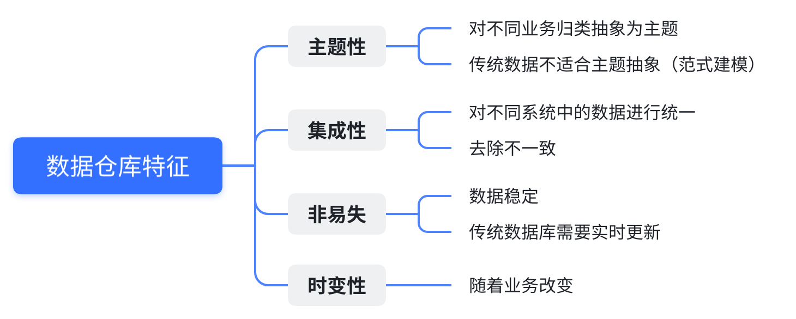

### 3.1.3 数据仓库的体系结构

数据仓库的体系结构通常包含4个层次：**数据源、数据存储和管理、数据服务以及数据应用**。

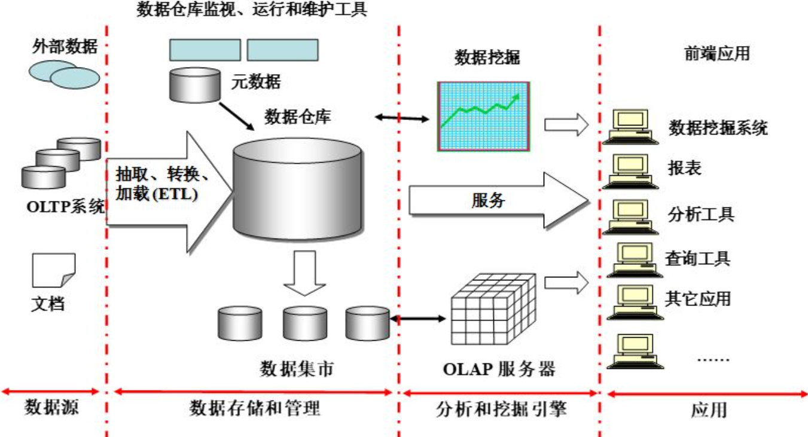

* **数据源：** 数据仓库的数据来源，包括外部数据、现有业务系统和文档资料等。
* **数据存储和管理：** 为数据提供的存储和管理，包括数据仓库、数据集市、数据仓库监视、运行与维护工具和元数据管理等。
* **数据服务：** 为前端工具和应用提供数据服务，包括直接从数据仓库中获取数据提供给前端使用，或者通过`OLAP`服务器为前端应用提供更为复杂的数据服务。
* **数据应用：** 直接面向最终用户，包括数据工具、自由报表工具、数据分析工具、数据挖掘工具和各类应用系统。

### 3.1.4 数据仓库解决的问题

1. 为业务部门提供准确及时的报表
2. 为管理人员提供更强的分析能力
3. 为数据挖掘和知识发现奠定基础

### 3.1.5 面临的挑战

随着大数据时代的全面到来，传统数据仓库也面临了如下挑战：

- 无法满足快速增长的海量数据存储需求
- 无法有效处理不同类型的数据
- 计算和处理能力不足

## 3.2 Hive基本概念

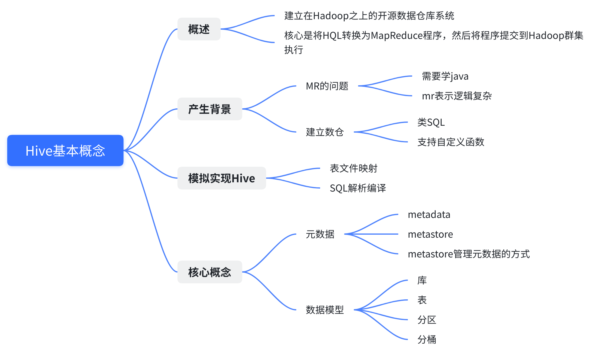

### 3.2.1 概述

**Hive是建立在Hadoop之上的一种数仓工具。**该工具的功能是将**结构化、半结构化**的数据文件映射为一张**数据库表**，基于数据库表，提供了一种类似`SQL` 的查询模型（`HQL`）,它具有最小的学习曲线，用于访问和分析存储在`Hadoop`文件中的大型数据集。

`Hive`本身并不具备存储功能，其核心是将`HQL`转换为`MapReduce`程序，然后将程序提交到`Hadoop`集群中执行。


**特点：**

1. 提供简单和优化的模型，编码少于MR（提供了类似`SQL`的查询语言`HiveQL`，两者都是基于SQL92标准,底层会自动转化为MapReduce）,使得精通`SQL`却不了解`Java`编程的人也能很好地进行大数据分析；
2. 灵活性高，可以自定义用户函数（UDF）和存储格式；
3. `Hive`支持在不同的计算框架上运行:`mapreduce`,`tez(比MapReduce的性能快了50倍)`，有超大的数据设计的计算和存储能力，集群扩展容易；
4. `Hive`支持在HDFS和HBase上进行临时查询数据。
5. 用于ETL和BI工具的成熟JDBC和ODBC驱动程序；
6. 统一的元数据管理，可以`presto`/`impala`/`sparksql`等共享数据；
7. 执行延迟高，不适合做数据的实时处理，但适合做海量数据的离线处理；

### 3.2.2 产生背景


`Hive`的产生背景主要有两个：

**- 使用成本高：** 使用`MapReduce`直接处理数据时，需要掌握`Java`等编程语言，学习成本较高，而且使用`MapReduce`不容易实现复杂查询；

**- 建立分析型数仓的需求：**`Hive`支持类`SQL`的查询以及支持自定义函数，可以作为数据仓库的工具。

`Hive`利用 `HDFS`存储数据，使用`MapReduce`查询分析数据。将`SQL`转换为`MapReduce`程序，从而完成对数据的分析决策。

### 3.2.3 当前Hive的主流版本

选择任何技术的版本要考虑哪些方面：功能，稳定性，可维护性，兼容性

- 策略：靠考虑不新不九的稳定版本
- 当前Hive的主流版本有两个
  - hive-1.x 其中使用比较多的是hive-1.2.x的版本，最后一个稳定版本是hive-1.2.2,如果使用这个版本，你的hive将来没法集成spark.
  - hive-2.x 现行主流的hive使用版本，现行稳定的hive-2.x版本中，我们选择使用hive-2.3.6
  - HDP（商业版大数据环境）2.6.3内置的hive为1.2.1

### 3.2.4 Hive集群构建

**单机版本环境构建**

- 用途：测试，学习，快速使用

```md
# 基本要求：启动hadoop
1. 上传安装包
apache-hive-2.3.6-bin.tar.gz

2. 解压安装包
tar -zxvf apache-hive-2.3.6-bin.tar.gz -C ../install/

3、进入到bin目录，运行hive脚本 
cd apache-hive-2.3.6-bin/bin 
./hive 

4、测试使用 
show databases;
```

**集群版环境构建**

```md
基本要求：
    安装好hadoop和mysql(mysql配置远程连接权限)

第1步：上传安装包
上传apache-hive-2.3.6-bin.tar.gz到服务器节点中。

第2步：解压安装包到对应的Hive安装目录中
tar -zxvf apache-hive-2.3.6-bin.tar.gz -C ../install/

第3步：创建配置文件 hive-site.xml
touch hive-site.xml
vi hive-site.xml

在这个新创建的配置文件中加入如下内容即可： 

<?xml version="1.0" encoding="UTF-8" standalone="no"?> 

<?xml-stylesheet type="text/xsl" href="configuration.xsl"?> 

<configuration> 

<property> 

<name>javax.jdo.option.ConnectionURL</name> 

<value>jdbc:mysql://hadoop1:3306/hive? 

createDatabaseIfNotExist=true&verifyServerCertificate=false&useSSL=false< 

/value> 

</property> 

<property> 

<name>javax.jdo.option.ConnectionDriverName</name> 

<value>com.mysql.jdbc.Driver</value> 

</property> 

<property> 

<name>javax.jdo.option.ConnectionUserName</name> 

<value>root</value> 

</property> 

<property> 

<name>javax.jdo.option.ConnectionPassword</name> 

<value>hadoop</value> 

</property> 

<property> 

<name>hive.metastore.warehouse.dir</name> 

<value>/user/hive/warehouse</value> 

</property> 

<property> 

<name>dfs.webhdfs.enabled</name> 

<value>true</value> 

</property> 

</configuration> 

第4步：加入MySQL驱动 

加入MySQL驱动包 mysql-connector-java-5.1.40-bin.jar 该jar包放置在hive的安装根路径下的 

lib目录中，hive要读写MySQL 

第5步：复制Hadoop集群的配置文件

**深度之眼 大数据开发实战**一定要记得把Hadoop集群中的 core-site.xml 和 hdfs-site.xml 两个配置文件都放置在Hive安装目 

录下conf目录中。 

cp core-site.xml hdfs-site.xml ~/install/apache-hive-2.3.6-bin/conf/

第6步：复制hive到其他节点 

scp -r apache-hive-2.3.6-bin root@hadoop2:/root/install 

scp -r apache-hive-2.3.6-bin root@hadoop3:/root/install 

第7步： 安装完成，配置环境变量 

export HIVE_HOME=/home/bigdata/apps/apache-hive-2.3.6-bin 

export PATH=$PATH:$HIVE_HOME/bin 

第8步：验证Hive安装 

hive --service version 

第9步：初始化元数据库 

注意：当使用的hive是1.x之前的版本，不做初始化也是OK的，当Hive第一次启动的时候会自动进行初始化， 

只不过会不会生成足够多的元数据库中的表。在使用过程中会慢慢生成。但最后进行初始化。如果使用的2.x版 

本的Hive，那么就必须手动初始化元数据库。使用命令： 

schematool -dbType mysql -initSchema 

第10步：启动Hive 客户端 

hive 

hive --service cli 

HiveServer2服务部署方法如下： 

修改的Hadoop集群中的 core-site.xml 和 hdfs-site.xml，并且一定要记得，所有节点都的修改。重 

启Hadoop集群 

第一步：修改hadoop集群的hdfs-site.xml配置文件：加入一条配置信息，表示启用webhdfs

<property> 

<name>dfs.webhdfs.enabled</name> 

<value>true</value> 

</property> 

第二步：修改hadoop集群的core-site.xml配置文件：加入两条配置信息：表示设置hadoop集群的代理用 

户

<property> 

<name>hadoop.proxyuser.root.hosts</name> 

<value>*</value> 

</property> 

<property> 

<name>hadoop.proxyuser.root.groups</name> 

<value>*</value> 

</property> 

启动Hiveserver2服务 

nohup hiveserver2 1>/root/install/apache-hive-2.3.6-bin/log/hiveserver.log 

2>/root/install/apache-hive-2.3.6-bin/log/hiveserver.err & 

启动beeline客户端，HUE,HDP的hive界面 

beeline -u jdbc:hive2://hadoop1:10000 -n root


扩展：Hiveserver2 Web UI 

Hive从2.0 版本开始，为 HiveServer2 提供了一个简单的 WEB UI 界面，界面中可以直观的看到当前链 

接的会话、历史日志、配置参数以及度量信息。 

hive-site.xml 配置文件： 

<property> 

<name>hive.server2.webui.host</name> 

<value>hadoop1</value> 

</property> 

<property> 

<name>hive.server2.webui.port</name> 

<value>15010</value> 

</property> 

重启 Hiveserver2，访问 Web UI：http://hadoop5:15010
```

### 3.2.5 Hive 元数据管理

- 为了支持schema和数据分区等功能，Hive将元数据保存在关系型数据库中。
- 默认情况下，hive将元数据保存在关系型数据库中。
  - 基于缺省Derby的非常适合测试
  - 用户之间不共享架构，因为每个用户都有自己的嵌入式Derby实例
  - 存储在`metastore_db`目录中，该目录位于启动配置单元的目录中
- 可以轻松切换另一个sql安装，如MySQL,Oracle。
- 作为Hive的一部分的HCatalog将Hive元数据暴露给其他生态系统。
- Hive3.0以上的版本，元数据是默认保存在Hbase里面，解决了HA的问题。

### 3.2.6 Hive体系架构

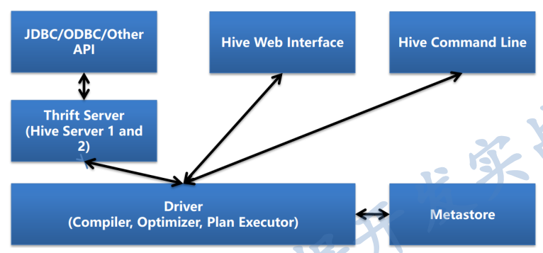

Note：解释一下经常遇到的`hiveServer1`、`hiveServer2`?早期版本的hiveServer(即hiveServer1)因使用Thrift接口的限制，不能处理多于一个客户端的并发请求，在hive-0.11.0版本中重写了hiveServer代码(hiveServer2)，支持了多客户端的并发和认证，并且为开放API客户端如`JDBC`、`ODBC`提供了更好的支持。

- 用户结构主要有三个：`CLI(command line interface)命令行`，`JDBC`和`Web UI`,`CLI`是开发过程中常用的接口，在hive server2 提供新的命令beeline,使用sqlline语法
- metaStore:hive的元数据结构描述信息库，可选用不同的关系型数据库来存储，通过配置文件修改、查看数据库配置信息。
- Driver:解释器、编译器、优化器完成`HQL`查询语句从语法分析、词法分析、编译、优化以及查询计划的生成。生成的查询计划存储在HDFS中，并在随后由`MapReduce`调用执行。
- Hive的数据存储在HDFS中，大部分的查询，计算由MapReduce完成
  - select * from emp;->操作不会执行mapreduce
  - select count(*) from emp; -> 执行mapreduce操作

**Hive Interface - CLI 和 Beeline模式的区别**

- 有两种工具：Beeline和命令行(CLI)
- 有两种模式：命令行模式和交互模式


| purpose(作用)     | HiveServer2 Beeline          | HiveServer1 CLI          |
| ------------------- | ------------------------------ | -------------------------- |
| Server Connection | beeline -u -n -p             | hive -h -p               |
| help              | beeline -h or beeline --help | hive -H                  |
| Run Query         | beeline -e beeline -f        | hive -e hive -f          |
| Define Variable   | beeline --hivevar key=value  | hive --hivevar key=value |


| Enter Mode    | beeline                     | hive               |
| --------------- | ----------------------------- | -------------------- |
| Connect       | !connect                    | N/A                |
| List Tables   | !table                      | show tables;       |
| List Columns  | !column <table_name>        | desc table_name;   |
| Run Query     |                             |                    |
| Save Result   | !record <file_name> !record | N/A                |
| Run Shell CMD | !sh ls                      | !ls;               |
| Run DFS CMD   | dfs -ls                     | dfs -ls;           |
| Run SQL File  | !run<file_name>             | source<file_name>; |
| Check Version | !dbinfo                     | !hive --version;   |
| Quit Mode     | !quit                       | quit;              |

Purpose HiveServer2 Beeline HiveServer1 CLI

**熟悉HDP-Hive环境**

```md
Hive Interface – 其他使用环境

Hive Web Interface (As part of Apache Hive)

--进入Hive cli

hive -e ：执行指定的SQL语句

hive -f ：执行指定的SQL脚本

hive -e "show databases”

echo "show databases" > demo.sql && hive -f demo.sql && rm -f demo.sql

--进入hive beeline

hive --service hiveserver2 开启服务

beeline -u jdbc:hive2://hadoop5:10000/db10 -n root -- 使用beeline连接hive

```

**Hive Interface - 其他使用环境**

- Hive Web Interface(As part of Apache Hive)
- Hue(Cloudera)
- Ambari Hive View(hortonworks)
- Zeppelin - Hive
- JDBC/ODBC (ETL工具，商业智能工具，集成开发环境)

### 3.2.7 Hive与Hadoop生态系统

下图描述了当采用`MapReduce`作为执行引擎时，`Hive`与`Hadoop`生态中其他组件的关系。

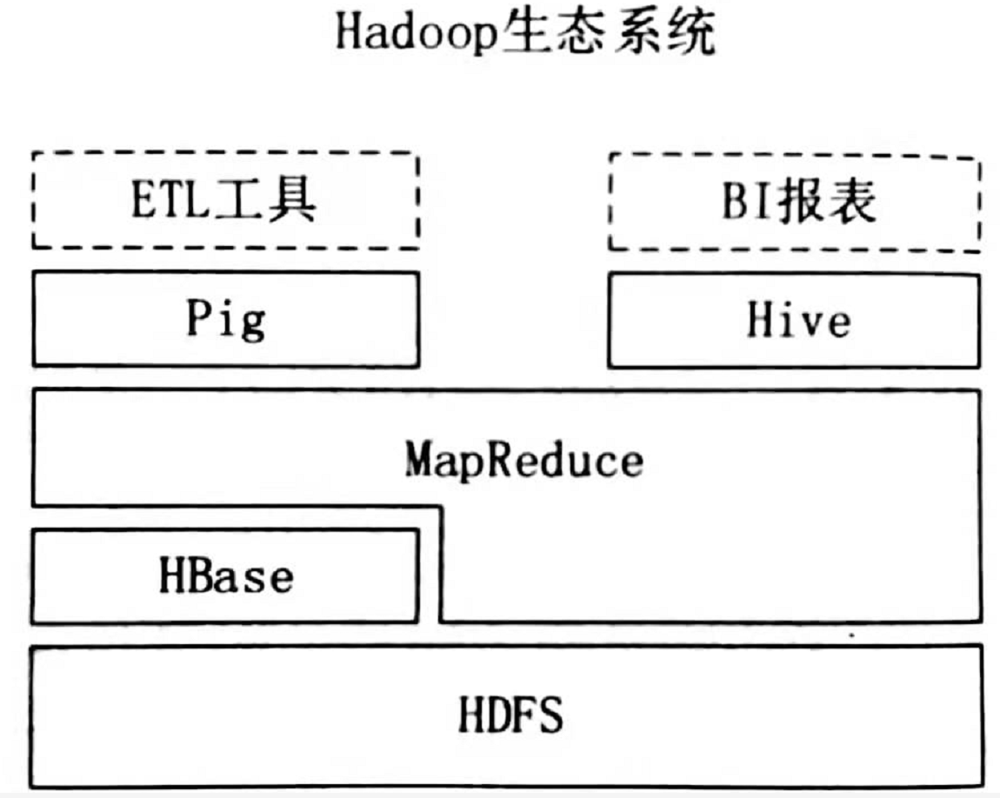

**- Hive与Hadoop生态的联系**

`HDFS`作为高可靠的底层存储方式，可以存储海量数据。`MapReduce`对这些海量数据进行批处理，实现高性能计算。`Hive`架构位于`MapReduce`、`HDFS`之上，其自身并不存储和处理数据，而是分别借助于`HDFS`和`MapReduce`实现数据的存储和处理，用`HiveQL`语句编写的处理逻辑，最终都要转换成`MapReduce`任务来运行。`pig`可以作为`Hive`的替代工具，它是一种数据流语言和运行环境，适用于在`Hadoop`平台上查询半结构化数据集，常用于数据抽取(`ETL`)部分，即将外部数据装载到`Hadoop`集群中，然后转换为用户需要的数据格式。

**- Hive与HBase的区别**

`HBase`是一个面向列式存储、分布式、可伸缩的数据库，它可以提供数据的实时访问功能，而`Hive`只能处理静态数据，主要是`BI`报表数据。就设计初衷而言，在`Hadoop`上设计`Hive`,是为了减少复杂`MapReduce`应用程序的编写工作，在`Hadoop`上设计`HBase`是为了实现对数据的实时访问。所以，`HBase`与`Hive`的功能是互补的，它实现了`Hive`不能提供的功能。

### 3.2.8 **Hive与传统数据库的对比**

`Hive`在很多方面和传统数据库类似，但是，它的底层依赖的是`HDFS`和`MapReduce`(或`tez`、`spark`)。以下将从各个方面，对`Hive`和传统数据库进行对比分析。


| 对比内容 | Hive                  | 传统数据库     |
| ---------- | ----------------------- | ---------------- |
| 数据存储 | HDFS                  | 本地文件系统   |
| 索引     | 支持有限索引          | 支持复杂索引   |
| 分区     | 支持                  | 支持           |
| 执行引擎 | MapReduce、Tez、Spark | 自身的执行引擎 |
| 执行延迟 | 高                    | 低             |
| 扩展性   | 好                    | 有限           |
| 数据规模 | 大                    | 小             |

## 3.3 Hive核心概念

### 3.3.1 Hive数据类型

- 基本数据类型

`Hive`表中的列支持以下基本数据类型：

- **integers(整型) :** TINYINT：1字节的有符号整数； SMALLINT：2字节的有符号整数； **INT：4字节的有符号整数**； BIGINT：8字节的有符号整数
- **Boolean(布尔型) :** BOOLEAN:TRUE/FALSE
- **Floating point numbers(浮点型) :** FLOAT:单精度浮点型；<br> DOUBLE:双精度浮点型
- **Fixed point numbers（定点数）:** **DECIMAL：用户自定义精度定点数，比如 DECIMAL(7,2)**
- **String types（字符串）:** STRING：指定字符集的字符序列； VARCHAR：具有最大长度限制的字符序列； CHAR：固定长度的字符序列;
- **Date and time types（日期时间类型）:** TIMESTAMP：时间戳； TIMESTAMP WITH LOCAL TIME ZONE：时间戳，纳秒精度； DATE：日期类型
- **Binary types（二进制类型）:**  BINARY：字节序列

> 注：TIMESTAMP和TIMESTAMP WITH LOCAL TIME ZONE的区别如下：
> TIMESTAMP WITH LOCAL TIME ZONE：用户提交TIMESTAMP给数据库时，会被转换成数据库所在的时区来保存。查询时，则按照查询客户端的不同，转换为查询客户端所在时区的时间。
> TIMESTAMP ：提交的时间按照原始时间保存，查询时，也不做任何转换。

- **隐式转换**

`Hive`中基本数据类型遵循以下的层次结构，按照这个层次结构，子类型到父类型允许隐式转换。 例如`INT`类型的数据允许隐式转换为`BIGINT`类型。额外注意的是：按照类型层次结构，允许将STRING类型隐式转换为DOUBLE类型。

- **复杂类型**


| STRUCT | 类似于对象，是字段的集合，字段的类型可以不同，可以使用`名称.字段名`方式进行访问 | STRUCT('xiaoming', 12 , '2018-12-12') |
| -------- | --------------------------------------------------------------------------------- | --------------------------------------- |
| MAP    | 键值对的集合，可以使用`名称[key]`的方式访问对应的值                             | map('a', 1, 'b', 2)                   |
| ARRAY  | 数组是一组具有相同类型和名称的变量的集合，可以使用`名称[index]`访问对应的值     | ARRAY('a', 'b', 'c', 'd')             |

- **Hive Meta Data Structure (元数据总览)**


| data structure | Logical                      | Physical (HDFS)   |
| ---------------- | ------------------------------ | ------------------- |
| Database       | A collection of tables       | Folder with files |
| table          | A collection of rows of data | Folder with files |
| partition      | Columns to split data        | folder            |
| Buckets        | Columns to distribute data   | Files             |
| Row            | Line of records              | Line in a file    |
| Columns        | slice of records             | Folder with files |
| Views          | shortcut of rows of data     | n/a               |
| index          | statistics of data           | folder with files |

### 3.3.3 Hive Database

- 数据库是用于类似目的或属于同一组的表的集合
- 如果未指定数据库（使用`database_name`）,则默认使用默认数据库`default`
- 默认数据库表目录位置：`/user/hive/warehouse`

```md
hive-site.xml 

<property> 

<name>hive.metastore.warehouse.dir</name> 

<value>/data/wapage/hive/warehouse</value> 

<description>location of default database for the warehouse</description> 

</property> 
```

```
数据库的语法操作： 

create database if not exists myhivebook; 

use myhivebook; 

show databases; 

describe database default; --more details than ’show’, such as location 

alter database myhivebook set owner user zs;

--级联删除，如果数据库下面有表的话，也可以删除 

drop database if exists myhivebook cascade;
```

### 3.3.4 Hive Tables

- External tables（外部表）：数据保存在Location关键字指定的HDFS路径中。由于DROP表（元数据）不会删除数据，因此Hive不会完全管理数据
- Internal Tables/Managed Table （内部表/管理表）：数据保存在默认路径中，例如/user/hive/warehouse/employee。 (数据完全由Hive管理，因为DROP表（元数据）将删除数据)
- 最大的区别：删除表的时候会不会删除数据。

  **思考问题？**

  1. what is internal and external tables ? 90%
  2. what is key difference between them ? 80%
  3. what is best practice to use them? 20%(最佳实践)

     - 用来处理原始数据和客户给出的树（不能修改数据，使用外部表）
     - 需要进行共享数据的时候使用外部表
     - 对数据清晰和转换的时候会使用内部表

  **Hive 建表基础语句**

  ```sql
  CREATE EXTERNAL TABLE IF NOT EXISTS employee_external ( 

  name string, 

  work_place ARRAY<string>, 

  sex_age STRUCT<sex:string,age:int>, 

  skills_score MAP<string,int>, 

  depart_title MAP<STRING,ARRAY<STRING>> 

  )

  COMMENT 'This is an external table' 

  ROW FORMAT DELIMITED FIELDS TERMINATED BY '|' 

  COLLECTION ITEMS TERMINATED BY ',' 

  MAP KEYS TERMINATED BY ':' 

  STORED AS TEXTFILE 

  LOCATION '/user/data/employee_data/';

  --查看表结构 

  desc table 

  desc formatted table 

  show create table
  ```

  - **建表和数据类型实践**

  ```sql
  show tables; 

  show tables '*sam*'; show tables '*sam|lily*' ; 

  show table extended like 'o*'; 

  desc [formatted|extended] table_name 

  show create table table_name; 

  select work_place,work_place[1] from employee_external; 

  select sex_age.age from employee_external; 

  select name, skills_score['DB'] from employee_external; 

  select ame, depart_title['Product'][0] from employee_external; 

  ```
- 复杂数据类型操作示例

下面是一个基本数据类型和复杂数据类型的使用示例：

```sql
CREATE TABLE students(
  name      STRING,   -- 姓名
  age       INT,      -- 年龄
  subject   ARRAY<STRING>,   -- 学科
  score     MAP<STRING,FLOAT>,  -- 各个学科考试成绩
  address   STRUCT<houseNumber:int, street:STRING, city:STRING, province:STRING>  -- 家庭居住地址
) ROW FORMAT DELIMITED FIELDS TERMINATED BY "\t";

```

### 3.3.2 Hive数据模型

`Hive`的数据都是存储在`HDFS`上的，默认有一个根目录，在`Hive-site.xml`中可以进行配置数据的存储路径。`Hive`数据模型的含义是，描述`Hive`组织、管理和操作数据的方式。`Hive`包含如下4种数据模型：

1. **库**

`Mysql`中默认数据库是`default`，用户可以创建不同的`database`,在`database`下也可以创建不同的表。`Hive`也可以分为不同的数据(仓)库，和传统数据库保持一致。在传统数仓中创建`database`。默认的数据库也是`default`。`Hive`中的库相当于关系数据库中的命名空间，它的作用是将用户和数据库的表进行隔离。

2. **表**

`Hive`中的表所对应的数据是存储在`HDFS`中，而表相关的元数据是存储在关系数据库中。Hive中的表分为内部表和外部表两种类型，两者的区别在于数据的访问和删除：

- 内部表的加载数据和创建表的过程是分开的，在加载数据时，实际数据会被移动到数仓目录中，之后对数据的访问是在数仓目录实现。而外部表加载数据和创建表是同一个过程，对数据的访问是读取`HDFS`中的数据；
- 内部表删除时，因为数据移动到了数仓目录中，因此删除表时，表中数据和元数据会被同时删除。外部表因为数据还在`HDFS`中，删除表时并不影响数据。
- 创建表时不做任何指定，默认创建的就是内部表。想要创建外部表，则需要使用`External`进行修饰


| 对比内容     | 内部表                                                                                                                                              | 外部表                                                                          |
| :------------- | :---------------------------------------------------------------------------------------------------------------------------------------------------- | :-------------------------------------------------------------------------------- |
| 数据存储位置 | 内部表数据存储的位置由`hive.Metastore.warehouse.dir`参数指定，<br/>默认情况下，表的数据存储在`HDFS`的`/user/hive/warehouse/数据库名.db/表名/`目录下 | 外部表数据的存储位置创建表时由`Location`参数指定                                |
| 导入数据     | 在导入数据到内部表，内部表将数据移动到自己的数据仓库目录下，<br/>数据的生命周期由`Hive`来进行管理                                                   | 外部表不会将数据移动到自己的数据仓库目录下，<br/>只是在元数据中存储了数据的位置 |
| 删除表       | 删除元数据（metadata）和文件                                                                                                                        | 只删除元数据（metadata）                                                        |

3. **分区**
     分区是一个优化的手段，目的是 **减少全表扫描** ，提高查询效率。在`Hive`中存储的方式就是表的主目录文件夹下的子文件夹，子文件夹的名字表示所定义的分区列名字。
4. **分桶**
     分桶和分区的区别在于：分桶是针对数据文件本身进行拆分，根据表中字段（例如，编号ID）的值，经过`hash`计算规则，将数据文件划分成指定的若干个小文件。分桶后，`HDFS`中的数据文件会变为多个小文件。分桶的优点是**优化join查询**和 **方便抽样查询** 。

## 3.4 Hive系统结构

  `Hive`主要由用户接口模块、驱动模型以及元数据存储模块3个模块组成，其系统架构如下图所示：


### 3.4.1 用户接口模块

  用户接口模块包括`CLI`、`Hive`网页接口（Hive Web Interface，HWI）、`JDBC`、`ODBC`、`Thrift Server`等，主要实现外部应用对`Hive`的访问。用户可以使用以下两种方式来操作数据：

* **CLI** （command-line shell）：`Hive`自带的一个命令行客户端工具，用户可以通过`Hive`命令行的方式来操作数据；
* **HWI** （Thrift/JDBC）：`HWI`是`Hive`的一个简单网页，`JDBC`、`ODBS`和`Thrift Server`可以向用户提供编程访问的接口。用户可以按照标准的`JDBC`的方式，通过`Thrift`协议操作数据。

### 3.4.2 驱动模块

  驱动模块（Driver）包括编译器、优化器、执行器等，所采用的执行引擎可以是 `MapReduce`、`Tez`或`Spark`等。当采用`MapReduce`作为执行引擎时，驱动模块负责把 `HiveQL`语句转换成一系列`MapReduce`作业，所有命令和查询都会进入驱动模块，通过该模块对输入进行解析编译，对计算过程进行优化，然后按照指定的步骤执行。

### 3.4.3 元数据存储模块

* **元数据：**
    元数据（metadata）是 **描述数据的数据** ，对于`Hive`来说，元数据就是用来描述`HDFS`文件和表的各种对应关系（位置关系、顺序关系、分隔符）。`Hive`的元数据存储在**关系数据库**中（`Hive`内置的是`Derby`、第三方的是`MySQL`），`HDFS`中存储的是数据。在`Hive`中，所有的元数据默认存储在`Hive`内置的`Derby`数据库中，但由于`Derby`只能有一个实例，也就是说不能有多个命令行客户端同时访问，所以在实际生产环境中，通常使用` MySQL`代替`Derby`。
    元数据存储模块（Metastore）是一个独立的关系数据库，通常是与`MySQL`数据库连接后创建的一个`MySQL`实例，也可以是`Hive`自带的`Derby`数据库实例，提供 **元数据服务** 。元数据存储模块中主要保存表模式和其他系统元数据，如表的名称、表的列及其属性、表的分区及其属性、表的属性、表中数据所在位置信息等。它提供给`Hive`操作管理访问元数据的一个服务，具体操作为`Metastore`对外提供一个服务地址，使客户端能够连接`Hive`，以此来对元数据进行访问。使用`Metastore`的好处如下：
  * 元数据把数据保存在关系数据库中，`Hive`提供元数据服务，通过对外的服务地址，用户能够使用客户端连接`Hive`，访问并操作元数据；
  * 支持多个客户端的连接，而客户端无需关心数据的存储地址，实现了数据访问层面的解耦操作。
  * 因此如果你在`Hive`上创建了一张表，然后在`presto`/`impala`/`sparksql`中都是可以直接使用的，它们会从`Metastore`中获取统一的元数据信息，同样的你在`presto`/`impala`/`sparksql`中创建一张表，在`Hive`中也可以直接使用。

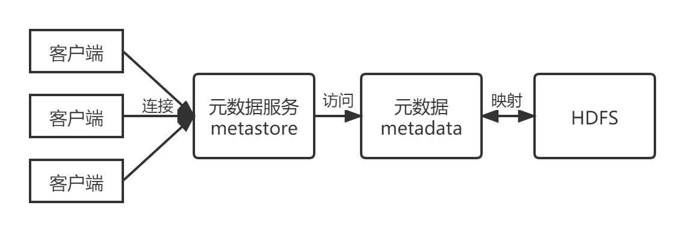

* **`Metastore`管理元数据的方式：**

1. **内嵌模式**
     `Metastore`**默认的**部署模式是`Metastore`元数据服务和`Hive`服务融合在一起。

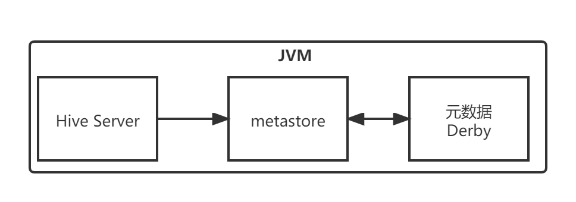

  在这种模式下，`Hive`服务（即`Hive`驱动本身）、元数据服务`Metastore`，元数据`metadata`（用于存储映射信息）都在同一个`JVM`进程中，元数据存储在内置的 **Derby数据库** 。当启动`HiveServer`进程时，`Derby`和`Metastore`都会启动，不需要额外启动`Metastore`服务。但是，一次只能支持一个用户访问，适用于测试场景。

2. **本地模式**
     本地模式与内嵌模式的区别在于：把元数据提取出来，让`Metastore`服务与`HiveServer`主进程在同一个`JVM`进程中运行，存储元数据的数据库在单独的进程中运行。元数据一般存储在`MySQL`关系型数据库中。

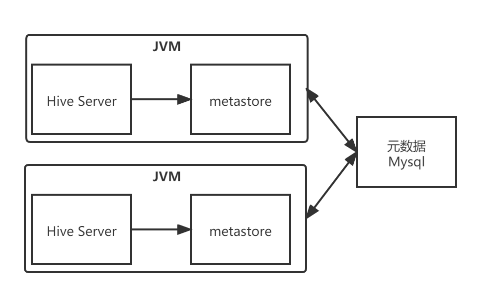

  但是，每启动一个`Hive`服务，都会启动一个`Metastore`服务。多个人使用时，会启用多个`Metastore`服务。

3. **远程模式**
     既然可以把元数据存储给提取出来，也可以考虑把`Metastore`给提取出来变为单独一个进程。把`Metastore`单独进行配置，并在单独的进程中运行，可以保证全局唯一，从而保证数据访问的安全性。（即不随`Hive`的启动而启动）

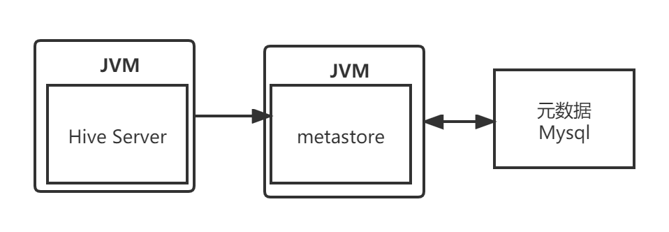

  其优点是把`Metastore`服务独立出来，可以安装到远程的服务器集群里，从而解耦`Hive`服务和`Metastore`服务，保证`Hive`的稳定运行。

### 3.4.4 HQL的执行流程

  `Hive`在执行一条`HQL`语句时，会经过以下步骤：

1. 语法解析：`Antlr`定义`SQL`的语法规则，完成`SQL`词法，语法解析，将`SQL`转化为抽象语法树`AST Tree`；
2. 语义解析：遍历`AST Tree`，抽象出查询的基本组成单元`QueryBlock`；
3. 生成逻辑执行计划：遍历`QueryBlock`，翻译为执行操作树`OperatorTree`；
4. 优化逻辑执行计划：逻辑层优化器进行`OperatorTree`变换，合并不必要的`ReduceSinkOperator`，减少`shuffle`数据量；
5. 生成物理执行计划：遍历`OperatorTree`，翻译为`MapReduce`任务；
6. 优化物理执行计划：物理层优化器进行`MapReduce`任务的变换，生成最终的执行计划。

> 关于 Hive SQL 的详细工作原理可以参考美团技术团队的文章：[HiveQL编译过程](https://tech.meituan.com/2014/02/12/hive-sql-to-mapreduce.html)

## 3.5 分区表

### 3.5.1 概念

Hive 中的表对应为`HDFS`上的指定目录，在查询数据时候，默认会对全表进行扫描，这样时间和性能的消耗都非常大。

**分区为HDFS上表目录的子目录**，数据按照分区存储在子目录。如果查询的`where`字句的中包含分区条件，则直接从该分区去查找，而不是扫描整个表目录，合理的分区设计可以极大提高查询速度和性能。

> 这里说明以下分区表并hive独有的概念，实际上这个概念非常常见。比如在我们常用的Oracle数据库中，当表中的数据量不断增大，查询数据的速度就会下降，这时也可以对表进行分区。表进行分区后，逻辑上表仍然是一张完整的表，只是将表中的数据存放到多个表空间（物理文件上），这样查询数据时，就不必要每次都扫描整张表，从而提升查询性能。

### 3.5.2 使用场景

通常，在管理大规模数据集的时候都需要进行分区，比如将日志文件按天进行分区，从而保证数据细粒度的划分，使得查询性能得到提升。

> 分区HDFS上表目录的子目录，数据按照分区存储在子目录中。

### 3.5.3 创建分区表

**在Hive中可以使用`PARTITIONED BY`子句创建分区表。**表可以包含一个或多个分区列，程序会为分区列中的每个不同值组合创建单独的数据目录。下面的我们创建一张雇员表作为测试：

```sql
CREATE EXTERNAL TABLE emp_partition(
empno Int,
ename STRING,
job STRING,
mgr INT,
hiredate TIMESTAMP,
sal DECIMAL(7,2),
comm DECIMAL(7,2)
)
PARTITIONED BY (deptno INT)  -- 按照部门编号进行分区
ROW FORMAT DELIMITED FIELDS TERMINATED BY "\t"
LOCATION '/hive/emp_partition';
```

### 3.5.4 加载数据到分区表

加载数据到分区表时候必须要指定数据所处的分区：

```sql
# 加载部门编号为20的数据到表中
LOAD DATA LOCAL INPATH "/usr/file/emp20.txt" OVERWRITE INTO TABLE emp_partition PARTITION (deptno=20)
# 加载部门编号为30的数据到表中
LOAD DATA LOCAL INPATH "/usr/file/emp30.txt" OVERWRITE INTO TABLE emp_partition PARTITION (deptno=30)
```

### 3.5.5 查看分区目录

这时候我们直接查看表目录，可以看到表目录下存在两个子目录，分别是`deptno=20`和`deptno=30`,这就是分区目录，分区目录下才是我们加载的数据文件。

```sql
# hadoop fs -ls hdfs://hadoop001:8020/hive/emp_partition/
```

这时候当你的查询语句的`where`包含`deptno=20`,则就去对应的分区目录下进行查找，而不用扫描全表。

## 3.6 粪桶表

### 3.6.1

分区提供了一个隔离数据和优化查询的可行方案，但是**并非所有的数据集都可以形成合力的分区**，分区的数量也不是越多越好，过多的分区条件可能会导致很多分区上没有数据。同时`Hive`会限制动态分区可以创建的最大分区数，用来避免过多分区文件对文件系统产生负担。鉴于以上原因，**Hive还提供了一种更加细粒度的数据拆分方案：分桶表（buket table）**。

**粪桶表会将指定列的值进行哈希散列，并对bucket(桶数量)取余，然后存储到对应的bucket(桶)中。**

### 3.6.2 理解分桶表

单从概念上理解分桶表可能会比较晦涩，其实和分区一样，分桶这个概念同样不是Hive独有的，对于Java开发人员而言，这可能是一个每天都会用到的概念，因为Hive中的分桶概念和Java数据结构中的HashMap的分桶概念是一致的。

单从概念上理解分桶表可能会比较晦涩，其实和分区一样，分桶这个概念同样不是 Hive 独有的，对于 Java 开发人员而言，这可能是一个每天都会用到的概念，因为 Hive 中的分桶概念和 Java 数据结构中的 HashMap 的分桶概念是一致的。

当调用 HashMap 的 put() 方法存储数据时，程序会先对 key 值调用 hashCode() 方法计算出 hashcode，然后对数组长度取模计算出 index，最后将数据存储在数组 index 位置的链表上，链表达到一定阈值后会转换为红黑树 (JDK1.8+)。下图为 HashMap 的数据结构图：

### 3.6.3 创建分桶表

**在 Hive 中，我们可以通过 ****`CLUSTERED BY`**** 指定分桶列，并通过 ****`SORTED BY`** ** 指定桶中数据的排序参考列** 。下面为分桶表建表语句示例：

```sql
  CREATE EXTERNAL TABLE emp_bucket(
    empno INT,
    ename STRING,
    job STRING,
    mgr INT,
    hiredate TIMESTAMP,
    sal DECIMAL(7,2),
    comm DECIMAL(7,2),
    deptno INT)
    CLUSTERED BY(empno) SORTED BY(empno ASC) INTO 4 BUCKETS  --按照员工编号散列到四个 bucket 中
    ROW FORMAT DELIMITED FIELDS TERMINATED BY "\t"
    LOCATION '/hive/emp_bucket';
```

### 3.6.4 加载数据到分桶表

这里直接使用 `Load` 语句向分桶表加载数据，数据时可以加载成功的，但是数据并不会分桶。

这是由于分桶的实质是对指定字段做了 hash 散列然后存放到对应文件中，这意味着向分桶表中插入数据是必然要通过 MapReduce，且 Reducer 的数量必须等于分桶的数量。由于以上原因，分桶表的数据通常只能使用 CTAS(CREATE TABLE AS SELECT) 方式插入，因为 CTAS 操作会触发 MapReduce。加载数据步骤如下：

**设置强制分桶**

```sql
set hive.enforce.bucketing = true; --Hive 2.x 不需要这一步
```

在 Hive 0.x and 1.x 版本，必须使用设置 `hive.enforce.bucketing = true`，表示强制分桶，允许程序根据表结构自动选择正确数量的 Reducer 和 cluster by column 来进行分桶。

**CTAS导入数据**

```sql
INSERT INTO TABLE emp_bucket SELECT *  FROM emp;  --这里的 emp 表就是一张普通的雇员表
```

可以从执行日志看到 CTAS 触发 MapReduce 操作，且 Reducer 数量和建表时候指定 bucket 数量一致：

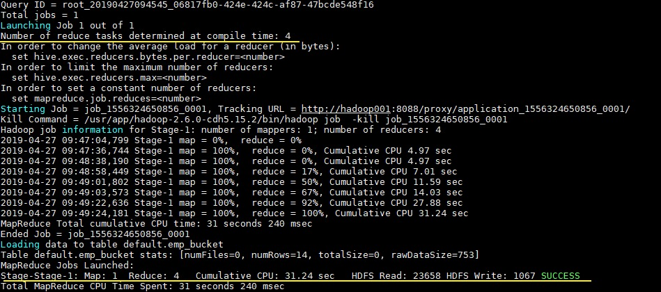

### 3.6.5 查看分桶文件

bucket(桶) 本质上就是表目录下的具体文件：

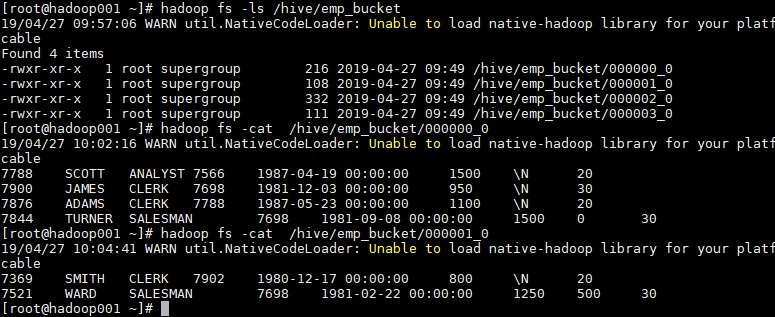

## 3.7 分区表和分桶表结合使用

分区表和分桶表的本质都是将数据按照不同粒度进行拆分，从而使得在查询时候不必扫描全表，只需要扫描对应的分区或分桶，从而提升查询效率。两者可以结合起来使用，从而保证表数据在不同粒度上都能得到合理的拆分。下面是 Hive 官方给出的示例：

```sql
CREATE TABLE page_view_bucketed(
    viewTime INT, 
    userid BIGINT,
    page_url STRING, 
    referrer_url STRING,
    ip STRING )
 PARTITIONED BY(dt STRING)
 CLUSTERED BY(userid) SORTED BY(viewTime) INTO 32 BUCKETS
 ROW FORMAT DELIMITED
   FIELDS TERMINATED BY '\001'
   COLLECTION ITEMS TERMINATED BY '\002'
   MAP KEYS TERMINATED BY '\003'
 STORED AS SEQUENCEFILE;
```

此时导入数据时需要指定分区：

```sql
INSERT OVERWRITE page_view_bucketed
PARTITION (dt='2009-02-25')
SELECT * FROM page_view WHERE dt='2009-02-25';
```