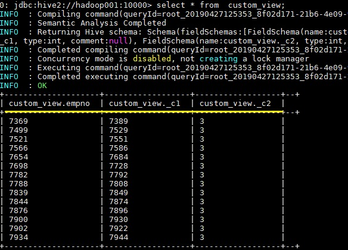
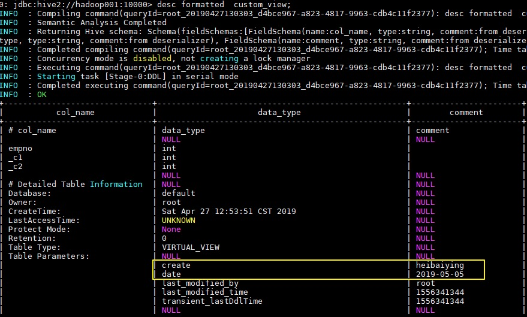
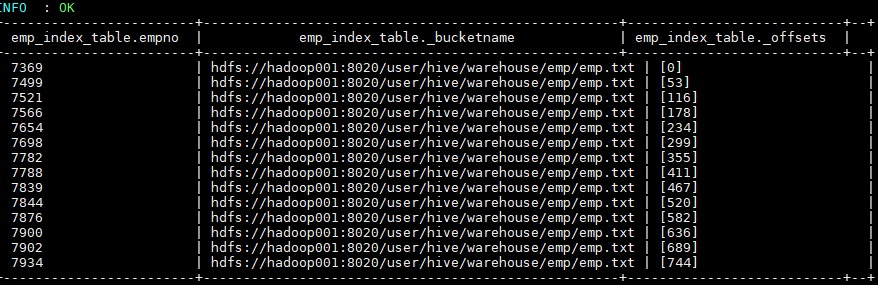
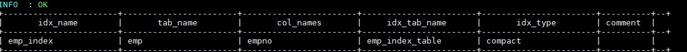
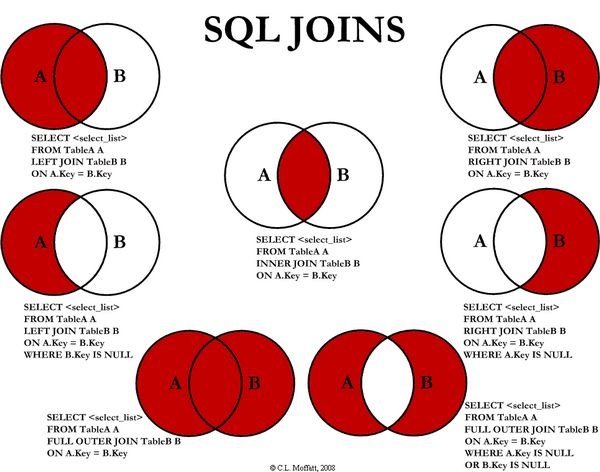
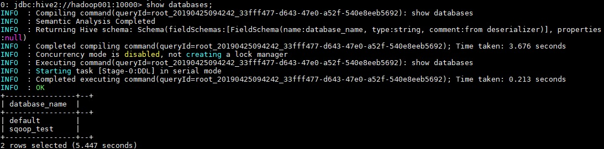

# Hive-数据仓库进阶

**本节目标**

- Hive视图和索引
- Hive数据查询
- Hive常用DDL操作
- Hive常用DML操作

## 5.1 视图

### 5.1.1 简介

Hive中的视图和RDBMS中视图的概念一致，都是一组数据的逻辑表示，本质上就是一条select语句的结果集。视图是纯粹的逻辑对象，没有关联的存储(Hive3.0.0引入的物化视图除外)，当查询引用视图时，Hive可以将视图的定义与查询结合起来，例如将查询中的过滤器推送到视图中。

### 5.1.2 创建视图

```sql
CREATE VIEW [IF NOT EXISTS] [db_name.]view_name   -- 视图名称
  [(column_name [COMMENT column_comment], ...) ]    --列名
  [COMMENT view_comment]  --视图注释
  [TBLPROPERTIES (property_name = property_value, ...)]  --额外信息
  AS SELECT ...;   
```

在 Hive 中可以使用 CREATE VIEW 创建视图，如果已存在具有相同名称的表或视图，则会抛出异常，建议使用 IF NOT EXISTS 预做判断。在使用视图时候需要注意以下事项：
视图是只读的，不能用作 LOAD / INSERT / ALTER 的目标；
在创建视图时候视图就已经固定，对基表的后续更改（如添加列）将不会反映在视图；
删除基表并不会删除视图，需要手动删除视图；
视图可能包含 ORDER BY 和 LIMIT 子句。如果引用视图的查询语句也包含这类子句，其执行优先级低于视图对应字句。例如，视图 custom_view 指定 LIMIT 5，查询语句为 select * from custom_view LIMIT 10，此时结果最多返回 5 行。
创建视图时，如果未提供列名，则将从 SELECT 语句中自动派生列名；
创建视图时，如果 SELECT 语句中包含其他表达式，例如 x + y，则列名称将以_C0，_C1 等形式生成；

```sql
CREATE VIEW  IF NOT EXISTS custom_view AS SELECT empno, empno+deptno , 1+2 FROM emp;
```



### 5.1.3 查看视图

```sql
-- 查看所有视图： 没有单独查看视图列表的语句，只能使用 show tables
show tables;
-- 查看某个视图
desc view_name;
-- 查看某个视图详细信息
desc formatted view_name;
```

### 5.1.4 删除视图

```sql
DROP VIEW [IF EXISTS] [db_name.]view_name;
```

### 5.1.5 修改视图

```sql
ALTER VIEW [db_name.]view_name AS select_statement;
```

被更改的视图必须存在，且视图不能具有分区，如果视图具有分区，则修改失败。

### 5.1.6 修改视图属性

语法：

```sql
ALTER VIEW [db_name.]view_name SET TBLPROPERTIES table_properties;

table_properties:
  : (property_name = property_value, property_name = property_value, ...)
```

示例：

```sql
ALTER VIEW custom_view SET TBLPROPERTIES ('create'='heibaiying','date'='2019-05-05');
```



## 5.2 索引

### 5.2.1 简介

Hive 在 0.7.0 引入了索引的功能，索引的设计目标是提高表某些列的查询速度。如果没有索引，带有谓词的查询（如'WHERE table1.column = 10'）会加载整个表或分区并处理所有行。但是如果 column 存在索引，则只需要加载和处理文件的一部分。

### 5.2.2 索引原理

在指定列上建立索引，会产生一张索引表（表结构如下），里面的字段包括：索引列的值、该值对应的 HDFS 文件路径、该值在文件中的偏移量。在查询涉及到索引字段时，首先到索引表查找索引列值对应的 HDFS 文件路径及偏移量，这样就避免了全表扫描。

```sql
+--------------+----------------+----------+--+
|   col_name   |   data_type    | comment     |
+--------------+----------------+----------+--+
| empno        | int            |  建立索引的列  |   
| _bucketname  | string         |  HDFS 文件路径  |
| _offsets     | array<bigint>  |  偏移量       |
+--------------+----------------+----------+--+
```

### 5.2.3 创建索引

```sql
CREATE INDEX index_name     --索引名称
  ON TABLE base_table_name (col_name, ...)  --建立索引的列
  AS index_type    --索引类型
  [WITH DEFERRED REBUILD]    --重建索引
  [IDXPROPERTIES (property_name=property_value, ...)]  --索引额外属性
  [IN TABLE index_table_name]    --索引表的名字
  [
     [ ROW FORMAT ...] STORED AS ...  
     | STORED BY ...
  ]   --索引表行分隔符 、 存储格式
  [LOCATION hdfs_path]  --索引表存储位置
  [TBLPROPERTIES (...)]   --索引表表属性
  [COMMENT "index comment"];  --索引注释
```

### 5.2.4 查看索引

```sql
--显示表上所有列的索引
SHOW FORMATTED INDEX ON table_name;
```

### 5.2.4 删除索引

删除索引会删除对应的索引表。

```sql
DROP INDEX [IF EXISTS] index_name ON table_name;
```

如果存在索引的表被删除了，其对应的索引和索引表都会被删除。如果被索引表的某个分区被删除了，那么分区对应的分区索引也会被删除。

### 5.2.5 重建索引

```sql
ALTER INDEX index_name ON table_name [PARTITION partition_spec] REBUILD;
```

重建索引。如果指定了 PARTITION，则仅重建该分区的索引。

## 5.3 索引案例

### 5.3.1 创建索引

在 emp 表上针对 empno 字段创建名为 emp_index,索引数据存储在 emp_index_table 索引表中

```sql
create index emp_index on table emp(empno) as  
'org.apache.hadoop.hive.ql.index.compact.CompactIndexHandler' 
with deferred rebuild 
in table emp_index_table ;
```

此时索引表中是没有数据的，需要重建索引才会有索引的数据。

### 5.3.2 重建索引

```sql
alter index emp_index on emp rebuild;
```

Hive 会启动 MapReduce 作业去建立索引，建立好后查看索引表数据如下。三个表字段分别代表：索引列的值、该值对应的 HDFS 文件路径、该值在文件中的偏移量。



### 5.3.3  自动使用索引

默认情况下，虽然建立了索引，但是 Hive 在查询时候是不会自动去使用索引的，需要开启相关配置。开启配置后，涉及到索引列的查询就会使用索引功能去优化查询。

```sql
SET hive.input.format=org.apache.hadoop.hive.ql.io.HiveInputFormat;
SET hive.optimize.index.filter=true;
SET hive.optimize.index.filter.compact.minsize=0;
```

### 5.3.4 查看索引

```sql
SHOW INDEX ON emp;
```



## 5.4 索引的缺陷

索引表最主要的一个缺陷在于：索引表无法自动 rebuild，这也就意味着如果表中有数据新增或删除，则必须手动rebuild，重新执行 MapReduce 作业，生成索引表数据。
同时按照[官方文档](https://cwiki.apache.org/confluence/display/Hive/LanguageManual+Indexing)的说明，Hive 会从 3.0 开始移除索引功能，主要基于以下两个原因：

- 具有自动重写的物化视图 (Materialized View) 可以产生与索引相似的效果（Hive 2.3.0 增加了对物化视图的支持，在 3.0 之后正式引入）。
- 使用列式存储文件格式（Parquet，ORC）进行存储时，这些格式支持选择性扫描，可以跳过不需要的文件或块。
  ORC 内置的索引功能可以参阅这篇文章：[Hive 性能优化之 ORC 索引–Row Group Index vs Bloom Filter Index](http://lxw1234.com/archives/2016/04/632.htm)

## 5.5 Hive数据查询

### 5.5.1 数据准备

为了演示查询操作，这里需要预先创建三张表，并加载测试数据。

> 数据文件 emp.txt 和 dept.txt 可以仓库[resources](https://github.com/heibaiying/BigData-Notes/tree/master/resources) 目录下载。

#### 5.5.1.1 员工表

```sql
 -- 建表语句
 CREATE TABLE emp(
     empno INT,     -- 员工表编号
     ename STRING,  -- 员工姓名
     job STRING,    -- 职位类型
     mgr INT,   
     hiredate TIMESTAMP,  --雇佣日期
     sal DECIMAL(7,2),  --工资
     comm DECIMAL(7,2),
     deptno INT)   --部门编号
    ROW FORMAT DELIMITED FIELDS TERMINATED BY "\t";

  --加载数据
LOAD DATA LOCAL INPATH "/usr/file/emp.txt" OVERWRITE INTO TABLE emp;
```

#### 5.5.1.2  部门表

```sql
 -- 建表语句
 CREATE TABLE dept(
     deptno INT,   --部门编号
     dname STRING,  --部门名称
     loc STRING    --部门所在的城市
 )
 ROW FORMAT DELIMITED FIELDS TERMINATED BY "\t";

 --加载数据
 LOAD DATA LOCAL INPATH "/usr/file/dept.txt" OVERWRITE INTO TABLE dept;
```

#### 5.5.1.3 分区表

这里需要额外创建一张分区表，主要是为了演示分区查询：

```sql
CREATE EXTERNAL TABLE emp_ptn(
      empno INT,
      ename STRING,
      job STRING,
      mgr INT,
      hiredate TIMESTAMP,
      sal DECIMAL(7,2),
      comm DECIMAL(7,2)
  )
 PARTITIONED BY (deptno INT)   -- 按照部门编号进行分区
 ROW FORMAT DELIMITED FIELDS TERMINATED BY "\t";


--加载数据
LOAD DATA LOCAL INPATH "/usr/file/emp.txt" OVERWRITE INTO TABLE emp_ptn PARTITION (deptno=20)
LOAD DATA LOCAL INPATH "/usr/file/emp.txt" OVERWRITE INTO TABLE emp_ptn PARTITION (deptno=30)
LOAD DATA LOCAL INPATH "/usr/file/emp.txt" OVERWRITE INTO TABLE emp_ptn PARTITION (deptno=40)
LOAD DATA LOCAL INPATH "/usr/file/emp.txt" OVERWRITE INTO TABLE emp_ptn PARTITION (deptno=50)
```

### 5.5.2 单表查询

#### 5.5.2.1 SELECT

```sql
-- 查询表中全部数据
SELECT * FROM emp;
```

#### 5.5.2.2 WHERE

```sql
-- 查询 10 号部门中员工编号大于 7782 的员工信息 
SELECT * FROM emp WHERE empno > 7782 AND deptno = 10;
```

#### 5.5.2.3  DISTINCT

Hive 支持使用 DISTINCT 关键字去重。

```sql
-- 查询所有工作类型
SELECT DISTINCT job FROM emp;
```

#### 5.5.2.4 分区查询

分区查询 (Partition Based Queries)，可以指定某个分区或者分区范围。

```sql
-- 查询分区表中部门编号在[20,40]之间的员工
SELECT emp_ptn.* FROM emp_ptn
WHERE emp_ptn.deptno >= 20 AND emp_ptn.deptno <= 40;
```

#### 5.5.2.5 LIMIT

```sql
-- 查询薪资最高的 5 名员工
SELECT * FROM emp ORDER BY sal DESC LIMIT 5;
```

#### 5.5.2.6 GROUP BY

Hive 支持使用 GROUP BY 进行分组聚合操作。

```sql
set hive.map.aggr=true;

-- 查询各个部门薪酬综合
SELECT deptno,SUM(sal) FROM emp GROUP BY deptno;
```

hive.map.aggr 控制程序如何进行聚合。默认值为 false。如果设置为 true，Hive 会在 map 阶段就执行一次聚合。这可以提高聚合效率，但需要消耗更多内存。

#### 5.5.2.7 ORDER AND SORT

可以使用 ORDER BY 或者 Sort BY 对查询结果进行排序，排序字段可以是整型也可以是字符串：如果是整型，则按照大小排序；如果是字符串，则按照字典序排序。ORDER BY 和 SORT BY 的区别如下：

* 使用 ORDER BY 时会有一个 Reducer 对全部查询结果进行排序，可以保证数据的全局有序性；
* 使用 SORT BY 时只会在每个 Reducer 中进行排序，这可以保证每个 Reducer 的输出数据是有序的，但不能保证全局有序。

由于 ORDER BY 的时间可能很长，如果你设置了严格模式 (hive.mapred.mode = strict)，则其后面必须再跟一个 `limit` 子句。

> 注 ：hive.mapred.mode 默认值是 nonstrict ，也就是非严格模式。

```sql
-- 查询员工工资，结果按照部门升序，按照工资降序排列
SELECT empno, deptno, sal FROM emp ORDER BY deptno ASC, sal DESC;
```

#### 5.5.2.8 HAVING

可以使用 HAVING 对分组数据进行过滤

```sql
-- 查询工资总和大于 9000 的所有部门
SELECT deptno,SUM(sal) FROM emp GROUP BY deptno HAVING SUM(sal)>9000;
```

#### 5.5.2.9 DISTRIBUTE BY

默认情况下，MapReduce 程序会对 Map 输出结果的 Key 值进行散列，并均匀分发到所有 Reducer 上。如果想要把具有相同 Key 值的数据分发到同一个 Reducer 进行处理，这就需要使用 DISTRIBUTE BY 字句。

需要注意的是，DISTRIBUTE BY 虽然能保证具有相同 Key 值的数据分发到同一个 Reducer，但是不能保证数据在 Reducer 上是有序的。情况如下：

把以下 5 个数据发送到两个 Reducer 上进行处理：

```sql
k1
k2
k4
k3
k1
```

Reducer1 得到如下乱序数据：

```sql
k1
k2
k1
```

Reducer2 得到数据如下：

```sql
k4
k3
```

如果想让 Reducer 上的数据时有序的，可以结合 `SORT BY` 使用 (示例如下)，或者使用下面我们将要介绍的 CLUSTER BY。

```sql
-- 将数据按照部门分发到对应的 Reducer 上处理
SELECT empno, deptno, sal FROM emp DISTRIBUTE BY deptno SORT BY deptno ASC;
```

#### 5.5.2.10 CLUSTER BY

如果 `SORT BY` 和 `DISTRIBUTE BY` 指定的是相同字段，且 SORT BY 排序规则是 ASC，此时可以使用 `CLUSTER BY` 进行替换，同时 `CLUSTER BY` 可以保证数据在全局是有序的。

```sql
SELECT empno, deptno, sal FROM emp CLUSTER  BY deptno ;
```

### 5.5.3 多表联结查询

Hive 支持内连接，外连接，左外连接，右外连接，笛卡尔连接，这和传统数据库中的概念是一致的，可以参见下图。

需要特别强调：JOIN 语句的关联条件必须用 ON 指定，不能用 WHERE 指定，否则就会先做笛卡尔积，再过滤，这会导致你得不到预期的结果 (下面的演示会有说明)。



#### 5.5.3.1 INNER JOIN

```sql
-- 查询员工编号为 7369 的员工的详细信息
SELECT e.*,d.* FROM 
emp e JOIN dept d
ON e.deptno = d.deptno 
WHERE empno=7369;

--如果是三表或者更多表连接，语法如下
SELECT a.val, b.val, c.val FROM a JOIN b ON (a.key = b.key1) JOIN c ON (c.key = b.key1)
```

#### 5.5.3.2 LEFT OUTER  JOIN

LEFT OUTER JOIN 和 LEFT JOIN 是等价的。

```sql
-- 左连接
SELECT e.*,d.*
FROM emp e LEFT OUTER  JOIN  dept d
ON e.deptno = d.deptno;
```


#### 5.5.3.3 RIGHT OUTER  JOIN

1

**--右连接**

```sql
--右连接
SELECT e.*,d.*
FROM emp e RIGHT OUTER JOIN  dept d
ON e.deptno = d.deptno;
```

执行右连接后，由于 40 号部门下没有任何员工，所以此时员工信息为 NULL。这个查询可以很好的复述上面提到的——JOIN 语句的关联条件必须用 ON 指定，不能用 WHERE 指定。你可以把 ON 改成 WHERE，你会发现无论如何都查不出 40 号部门这条数据，因为笛卡尔运算不会有 (NULL, 40) 这种情况。


2020-10-19-MjitHh

#### 5.5.3.4 FULL OUTER  JOIN

```sql
SELECT e.*,d.*
FROM emp e FULL OUTER JOIN  dept d
ON e.deptno = d.deptno;
```

#### 5.5.3.5 LEFT SEMI JOIN

LEFT SEMI JOIN （左半连接）是 IN/EXISTS 子查询的一种更高效的实现。

* JOIN 子句中右边的表只能在 ON 子句中设置过滤条件;
* 查询结果只包含左边表的数据，所以只能 SELECT 左表中的列。

```sql
-- 查询在纽约办公的所有员工信息
SELECT emp.*
FROM emp LEFT SEMI JOIN dept 
ON emp.deptno = dept.deptno AND dept.loc="NEW YORK";

--上面的语句就等价于
SELECT emp.* FROM emp
WHERE emp.deptno IN (SELECT deptno FROM dept WHERE loc="NEW YORK");
```

## 3.6 JOIN

笛卡尔积连接，这个连接日常的开发中可能很少遇到，且性能消耗比较大，基于这个原因，如果在严格模式下 (hive.mapred.mode = strict)，Hive 会阻止用户执行此操作。

```sql
SELECT * FROM emp JOIN dept;
```

### 5.5.4 JOIN优化

#### 5.5.4.1 STREAMTABLE

在多表进行联结的时候，如果每个 ON 字句都使用到共同的列（如下面的 `b.key`），此时 Hive 会进行优化，将多表 JOIN 在同一个 map / reduce 作业上进行。同时假定查询的最后一个表（如下面的 c 表）是最大的一个表，在对每行记录进行 JOIN 操作时，它将尝试将其他的表缓存起来，然后扫描最后那个表进行计算。因此用户需要保证查询的表的大小从左到右是依次增加的。

```sql
`SELECT a.val, b.val, c.val FROM a JOIN b ON (a.key = b.key) JOIN c ON (c.key = b.key)`
```

然后，用户并非需要总是把最大的表放在查询语句的最后面，Hive 提供了 `/*+ STREAMTABLE() */` 标志，用于标识最大的表，示例如下：

```sql
SELECT /*+ STREAMTABLE(d) */  e.*,d.* 
FROM emp e JOIN dept d
ON e.deptno = d.deptno
WHERE job='CLERK';
```

#### 5.5.4.2 MAPJOIN

如果所有表中只有一张表是小表，那么 Hive 把这张小表加载到内存中。这时候程序会在 map 阶段直接拿另外一个表的数据和内存中表数据做匹配，由于在 map 就进行了 JOIN 操作，从而可以省略 reduce 过程，这样效率可以提升很多。Hive 中提供了 `/*+ MAPJOIN() */` 来标记小表，示例如下：

```sql
SELECT /*+ MAPJOIN(d) */ e.*,d.* 
FROM emp e JOIN dept d
ON e.deptno = d.deptno
WHERE job='CLERK';
```

### 5.5.5. SELECT的其他用途

查看当前数据库：

```sql
SELECT current_database()
```

### 5.5.6. 本地模式

在上面演示的语句中，大多数都会触发 MapReduce, 少部分不会触发，比如 `select * from emp limit 5` 就不会触发 MR，此时 Hive 只是简单的读取数据文件中的内容，然后格式化后进行输出。在需要执行 MapReduce 的查询中，你会发现执行时间可能会很长，这时候你可以选择开启本地模式。

```sql
--本地模式默认关闭，需要手动开启此功能
SET hive.exec.mode.local.auto=true;
```

启用后，Hive 将分析查询中每个 map-reduce 作业的大小，如果满足以下条件，则可以在本地运行它：

* 作业的总输入大小低于：hive.exec.mode.local.auto.inputbytes.max（默认为 128MB）；
* map-tasks 的总数小于：hive.exec.mode.local.auto.tasks.max（默认为 4）；
* 所需的 reduce 任务总数为 1 或 0。

因为我们测试的数据集很小，所以你再次去执行上面涉及 MR 操作的查询，你会发现速度会有显著的提升。

## 5.6 DDL操作

### 5.6.1 Database

#### 5.6.1.1 查看数据列表

```sql
show databases;
```



#### 5.6.1.2 使用数据库

```sql
USE database_name;
```
